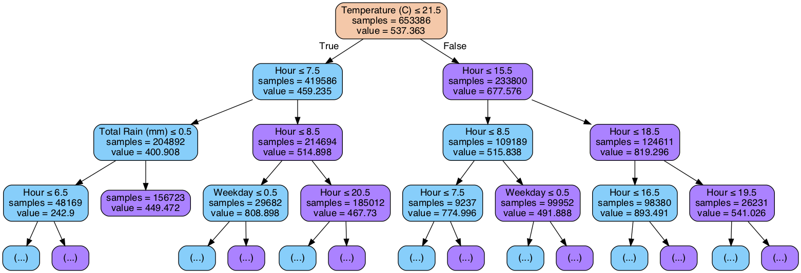
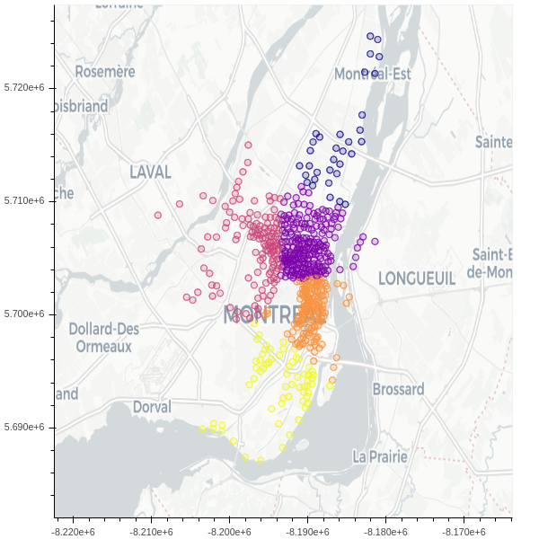
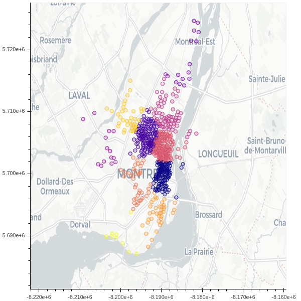

# SOEN499Project

Nizar Belhassan 27519443

## Abstract
There is a significant need for companies to analyze fast-growing data to answer certain demand and interests. This includes estimating situations, creating new business strategies, and decision making. In this project, we are going to analyze open data from BIXI using Scikit-learn. In the following paragraphs we discuss and interpret the results from three techniques learned in this course, mainly, Decision Trees, Random Forest, and K-means clustering.

## Introduction
Bike-sharing systems are becoming increasingly popular in urban areas. Montreal’s bike sharing system, Bixi, first appeared in 2009. It was later exported to other cities in the world such as New York and Toronto. Bixi’s challenge today is to ensure the best service level for their users, which includes availability of bikes throughout the city. Vehicles have caused a polluted environment and many traffics. Therefore, many cities are encouraging their citizens to bike instead of driving. This will encourage a greener, healthier environment and limit the number of vehicles on the road due to the concerns over traffic congestion, pollution, and climate change. 

In order to achieve maximum availability for clients, we needed to analyse the traffic in the city at any given time. Therefore, we used Bixi’s data to analyze the main objective which is to predict the number of bikes on the road in Montréal for a given hour on any day of the year based on the weather forecast such as rain/snow. Through the analysis, we discovered how factors such as temperature and precipitation influence the ridership volume and how ridership varies in and between neighborhoods. 

In regards to the related work, there are many other projects made on the analysis of the Bixi dataset. One of the projects that were found is [How does weather impact bike traffic in Montreal?](https://web.meteo.mcgill.ca/cmccray/weather-bike-traffic-montreal/). This project shows how the weather affects the usage of Bixi bikes and the cyclists.
 
 
## Materials and Methods

### Dataset
The datasets that were used for this task were Bixi’s open data and weather history open data. The BIXI dataset contains 8 datasets for the year 2019. These datasets included descriptive data of every BIXI trip for each month (april to october) and a list of locations of BIXI stations (GPS coordinates). The weather history dataset was gathered from the Government of Canada’s historical climate data which consisted of descriptive data of the daily/hourly weather of the year 2019 including temperature, precipitation, degree days, relative humidity, wind speed etc. 

In the Bixi dataset, each row corresponded to a single user’s trip. We analyzed and combined the exact start and end dates and times of Bixi trips in Montréal into Hour, Weekday, and Month using numerical imputation and date extraction techniques. Furthermore, the column for volume of trips was constructed by iterating through all the trips. For the weather data, dictionaries were constructed in which the key was a date along with time for temperature in 2019, and the corresponding value was the respective weather metric of that dictionary. We then matched each trip to its weather conditions by start date and time. At the end, there were only six predictors: Temperature, Total Rain (mm), Total Snow (cm), Hour, Weekday, Month. These predictors were analyzed against the trip volume which we consider our natural dataset.

To enhance our Natural dataset’s interpretability, we attempted to implement some data engineering to our datasets. We transformed four of our six predictors into binary encoding. Precipitation took the value 1 if there was rain/snow on a given day, and 0 otherwise. We assigned 1 to weekdays and 0 weekends since we noticed substantial differences in the volume on weekdays vs weekends. Finally, we transformed May-September as warm with a value of 1, and other months as 0.

### Technologies
The technologies that will be used are Scikit-learn, Pandas, Numpy, Graphviz. Scikit-learn is a machine learning library for Python. It is used for classification, regression and clustering algorithms. Pandas is a software library written for data manipulation and analysis. Numpy is a general purpose array-processing and scientific computing library, and Graphviz is a library used for plotting graphs. Pandas and Numpy libraries were used to generate the natural and engineered datasets.
 
### Algorithms
Two regression techniques were used to predict the volume of Bixi rides for a given hour. The techniques are decision tree regression and random forest regression.  Decision trees build regression or classification models in the form of a tree structure. It breaks down a dataset into smaller and smaller subsets while at the same time an associated decision tree is incrementally developed. The final result is a tree with decision nodes and leaf nodes. A random forest is simply a collection of decision trees whose results are aggregated into one final result. 

These two regression techniques were applied to natural and our fore-mentioned engineered datasets. We compared the techniques and datasets based on the results and success of their prediction. We based our evaluation on the Root Mean Square Error (RMSE) which is a standard way to measure the error of a model prediction. We also evaluated and compared the computing time of decision tree and random forest, as well as our engineered and natural data. 

Key Machine Learning concepts were used for our prediction, mainly, Features, Labels, Training and Testing sets. The Features are individual independent variables that act as input, and prediction models (decision tree and random forest) use them to make predictions. Based on our natural and engineered dataset, the Features are Temperature (C), Total Rain (mm), Total Snow (cm), Hour, Weekday, and Month. The Labels are the final output which is the volume of Bixi trips for a given hour of the day. 70% of natural and engineered datasets were used as training and the remaining 30% of the two datasets as testing. Equivalent train-test percentage is used for the both regression techniques. 

The initial goal of this project was to analyze the volume per cluster (neighborhood) to then use the regression techniques to assess how many bikes were needed at a given time per neighborhood. For that, we needed a clustering technique for which we resorted to K-means Clustering. K-Means is a very simple algorithm which clusters the data into a K number of clusters. We will form clusters with the Bixi stations and compare the inter-cluster and intra-cluster euclidean distances. Inter-cluster distance is the distance between two objects belonging to two different clusters and Intra-cluster distance is the distance between two objects belonging to the same cluster.
 
## Results

### Decision Trees

Decision Tree regression was used as our first algorithm and was fitted using both the engineered set and the natural set which we then compared to see which of two sets generated better results. In order to decide on the best value for the minimum number of data points allowed in a leaf node, we performed k-fold cross validation with k=5 to select the hyperparameter setting. The values tested for the hyperparameter “min_samples_leaf” were {10,50,100,250,500,750,1000,1250,1500,1750,2000} for which the optimal result was 10.
The “min_samples_leaf” is the minimum number of samples needed to be considered a leaf node in our decision tree. This parameter is used to limit the growth of the tree.

Figure 1. First three layers of decision tree fitted to natural dataset

The decision tree achieved a root means square error of 0.10561 for the natural data.
As for the engineered data, we achieved a root means square error of 0.28918. Which means that although it simplifies the data and makes it easier to understand, our feature engineering is not as effective as the natural data hence, it does not make the underlying relationships between the predictors and the response variables easier to learn. Although we did have a slightly improved computation time with the engineered data, being 33.28 seconds versus 38.02 seconds for the natural data. For our case this difference is near negligible, although on a bigger data set, will make a substantial difference.

Figure 2. First three layers of decision tree fitted to engineered dataset

### Random Forest

Due to the promising results achieved from the performance of the decision tree regression, we wanted to see how much more accuracy we could achieve from an enhanced decision tree, mainly, random forest. In order to determine the most optimal performance, we needed to find out the best value for the number of estimators to use for our model. Therefore we tested a range of values: {10, 20, 30, 40, 50, 60, 70, 80, 90, 100} for which we concluded that 60 gave the smallest root means square error with it being 0.07932 with 10 being the minimum number of data points allowed in a leaf node as discussed previously. When applied to our engineered data set, we found a slightly higher rmse which was 0.28918. This model took 41.80 seconds to run on the natural data, and 29.13 seconds for our engineered data. As discussed for the decision tree, this time difference would have a much bigger impact had the data set been larger.

### K-means Clustering

K-means clustering was used to group Bixi stations into neighborhoods. The initial goal of this clustering section was to identify the clusters/neighborhoods that had the most volume coming in and out of them, to then predict how many available bikes should be within a neighborhood at a given time.

The dataset used contained the longitude and latitude coordinates which were later converted to GPS coordinates. The number of clusters k was chosen and plotted on a geographical map. The euclidean distances of each Bixi station were calculated in the same cluster as well as in two different clusters to identify the average inter-cluster and intra-cluster distances. Figure 3 and Figure 4 demonstrate the inter-cluster and intra-cluster distances for k=5 and k=10. In comparison, unsurprisingly k=10 gave a smaller result for the intra-cluster distance since we split the set into a larger number of clusters than k=5. 

Figure 3. K = 5

Inter Cluster distance: 7763.158174063148

Intra Cluster distance: 1893.066799630896

Figure 4. K = 10

Inter Cluster distance: 8957.119364386203

Intra Cluster distance: 1479.722123432825

## Discussion
Initially, our goal was to identify the neighborhoods which had the most volume coming in and out of them. This would have allowed us to predict how many bikes must be available at a given time per cluster, which would help solve the problem of availability. We aimed to break down our datasets into clusters to then use the regression techniques mentioned to predict the volume per cluster. This was proved outside of the capabilities of the team due to time constraints.

Based on our results, we can notice that the value of the root mean squared error is very low for both techniques used. This implies that the error of our models in terms of prediction is very low making our predictions relatively accurate. The main reason behind remains in the fact that our dataset is not noisy. The noise is the error bound to the collected data. Machine learning techniques can be fooled by the noise in the data as the algorithms can think of noise to be a pattern and can start generalizing from it. This leads to incorrect generalizations resulting in a higher root mean squared error.

## References
https://towardsdatascience.com/feature-engineering-for-machine-learning-3a5e293a5114

https://medium.com/analytics-vidhya/types-of-categorical-data-encoding-schemes-a5bbeb4ba02b

https://www.geeksforgeeks.org/ml-intercluster-and-intracluster-distance/

https://stackabuse.com/random-forest-algorithm-with-python-and-scikit-learn/

https://towardsdatascience.com/data-visualization-with-bokeh-in-python-part-one-getting-started-a11655a467d4
 
https://magoosh.com/data-science/what-is-deep-learning-ai/
